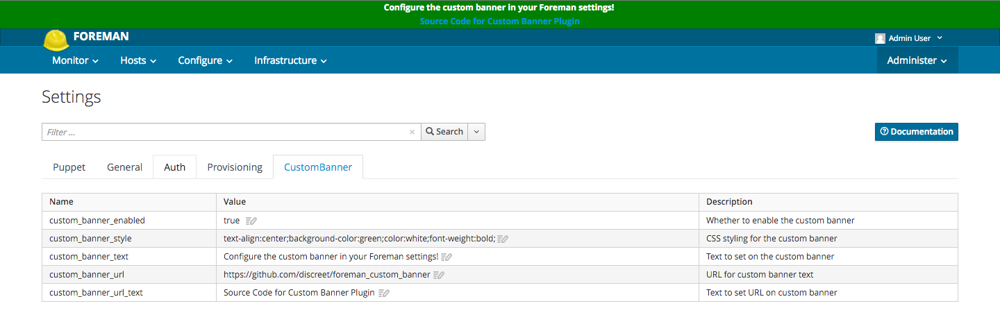
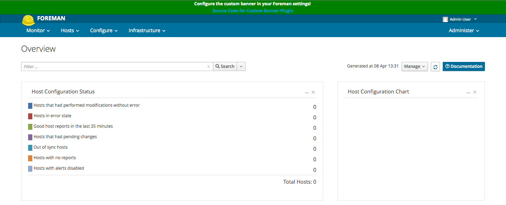
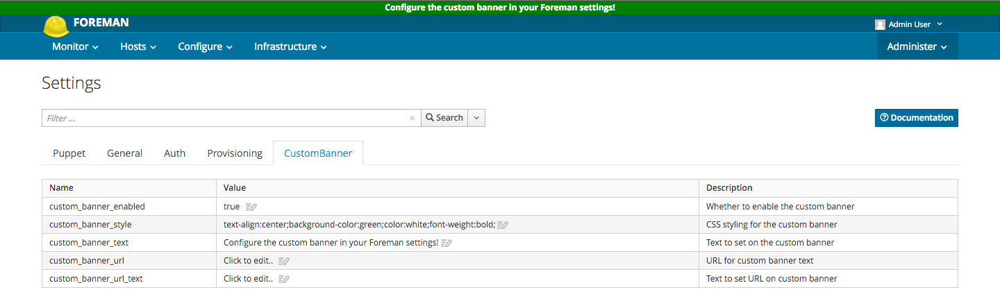
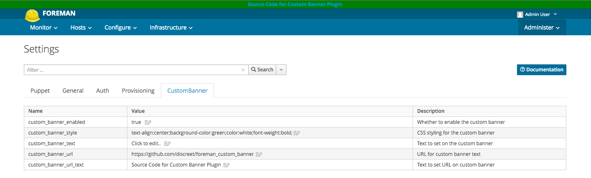

# foreman\_custom\_banner

A Foreman plugin which provides a configurable, custom banner for the Foreman UI.

The purpose of this plugin is to provide a simple way to distinguish multiple
installations of Foreman, e.g. a production vs. a development installation. As
well as the possibility of a link to a "help" or "quick start" page.

# Installation

* Build and install the rubygem
* Add ``install/foreman_custom_banner.rb`` into Foreman's ``bundler.d``
  directory.
  E.g. in the packaged Foreman installation, ``/usr/share/foreman/bundler.d``
* Restart the webserver hosting the Foreman application

# Configuration

You configure the custom banner from the `Settings` page on the `Custom Banner`
tab:



With a default installation the custom banner would look like this:



If you only wanted to have a banner text simply remove the `custom_banner_url`
and `custom_banner_url_text` values:



If you only wanted to have a banner url simply remove the `custom_banner_text`
value:



You can alter the style of the custom banner by changing the values for the
`custom_banner_style` field. This field will accept any CSS style configuration

# Building the Package

YMMV, but this should work okay if you have the right build dependencies installed:

```console
$ gem build foreman_custom_banner.gemspec
$ mv *.gem $(rpm --eval '%{_sourcedir}')
$ rpmbuild -ba foreman_custom_banner.spec --define 'scl tfm'
```
